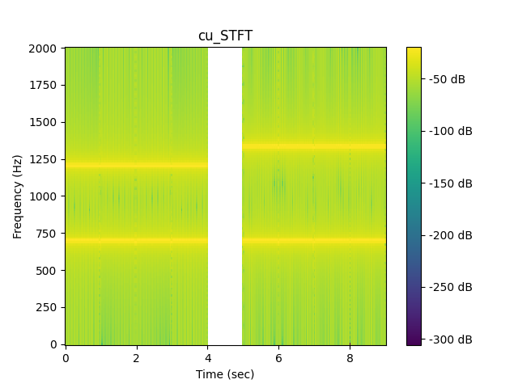

# MusicClassification
A personal project for creating a deep neural network for music classification

## Description
This project is split into two phases. The first phase is collecting music files in the .wav format and getting their Power Spectral Density information using a Short Time Fourier Transform CUDA kernel. Using the STFT, it becomes feasible to extract more meaningful features from music files that will assist in its classification for the neural network. The second phase is the neural network itself which will be trained on 
the [GTZAN](https://www.kaggle.com/datasets/andradaolteanu/gtzan-dataset-music-genre-classification) music dataset. After the training phase, the 
neural network will hopefully be able to accurately determine the genre of any new song it gets fed. 

## Progress
I am currently wrapping up the first phase. I have successfully been able to create CPP functions for reading .wav files and a CUDA STFT function 
for feature extraction. With the help of Pybind11, I have also made these functions into a module that are callable from a Python file. The directory *python_testbenches/* houses python files that are meant to test each function that I turned into a Python module, crosschecked with 
already existing functions from libraries in Python such as **Numpy** and **Scipy**. 

The images below show the spectograms generated from my personal CUDA STFT kernel (top) and from Scipy's STFT function (below). As you can see, the results match and the testbenches show that my implementation is algorithimically and accurately correct. After finishing the neural network, I will revisit this kernel since it is correct, but needs additional optimizations to run faster than Scipy's STFT implementation. For these spectograms, my implementation on average takes 12 ms, and Scipy's takes 2 ms. The results can be reproduced from the *stft_introduction.ipynb* notebook. 




## Setup

In order to run this project, you will need Ubuntu 20.04 and a machine equipped with a NVIDIA RTX. It is also possible to run this project on a Windows machine through WSL as long as it's running Ubuntu 20.04. Below is how to install WSL and set up CUDA for it. For setting up CUDA on a Linux machine with Ubuntu 20.04, you will have to look up the setup process online since these instructions only apply for WSL. 

**NOTE:** This project may work on other versions of Ubuntu but I will heavily suggest version 20.04 since that is the only version I've tested this project. In the future, I will look into using Docker to assist in creating and setting up a Linux environment that has all its dependencies installed such that the local setup process is not so tedious. 

```sh
# in Windows Command Prompt
wsl.exe --install
wsl.exe --update
C:\> wsl.exe

# in WSL terminal
$ sudo apt-key del 7fa2af80
$ wget https://developer.download.nvidia.com/compute/cuda/repos/wsl-ubuntu/x86_64/$ cuda-wsl-ubuntu.pin
$ sudo mv cuda-wsl-ubuntu.pin /etc/apt/preferences.d/cuda-repository-pin-600
$ wget https://developer.download.nvidia.com/compute/cuda/12.0.0/local_installers/$ cuda-repo-wsl-ubuntu-12-0-local_12.0.0-1_amd64.deb
$ sudo dpkg -i cuda-repo-wsl-ubuntu-12-0-local_12.0.0-1_amd64.deb
# The previous command may produce an output that may be slightly different than the command below. If so, use the command from the terminal output instead
$ sudo cp /var/cuda-repo-wsl-ubuntu-12-0-local/cuda-*-keyring.gpg /usr/share/keyrings/
$ sudo apt-get update
$ sudo apt-get -y install cuda
$ sudo apt install nvidia-cuda-toolkit
```
Again, the above commands are for setting up CUDA on WSL. If you are using a desktop running Ubuntu 20.04 (not through WSL), then you will have to find resources online on how to setup CUDA. 

After setting up CUDA for your machine, run the following commands to get other dependencies set up so that this repository can build. 

**NOTE:** I will be updating this very soon since there is one command missing that specifies CMake to not use BOOST but I need to rediscover this command. This is an issue since building the project generates a BOOST error even though this repo is perfectly capable of working without the BOOST library. 

```sh
# setting up and upgrading CMake
$ sudo apt purge --auto-remove cmake
$ wget -O - https://apt.kitware.com/keys/kitware-archive-latest.asc 2>/dev/null | gpg --dearmor $ - | sudo tee /etc/apt/trusted.gpg.d/kitware.gpg >/dev/null
$ sudo apt-add-repository 'deb https://apt.kitware.com/ubuntu/ focal main'
$ sudo apt update
$ sudo apt install cmake

# installing Python and dev libraries
$ sudo apt-get install python3
$ sudo apt-get install python-dev

# installing NumCPP (Note: you can do this in any directory)
$ cd <your_directory>
$ git clone https://github.com/dpilger26/NumCpp.git

$ cd NumCpp
$ mkdir build
$ cd build
$ cmake .. # need to find command that builds without BOOST
$ sudo cmake --build . --target install

# in your preferred directory, you can finally set up this repository
$ cd <your_other_directory>
$ git clone https://github.com/jorgejc2/MusicClassification.git
$ git submodule update --init
```

Go to into the *build/* directory and run:

```sh
$ cmake .. && make clean && make
```

Afterwards, you can find executables in the *build/example/* directory and run them, or go to the root directory and run the files in *python_testbenches/*. Most of the code in *stft_introduction.ipynb* can run with out this entire set up process but some blocks of code that utilize the CUDA functions will not work since they must be compiled from the previous commands. Only the *stft_introduction.ipynb* notebook is fully updated and goes into explanation on how the Short Time Fourier Transform works and demonstrates its usefulness for extracting frequency content from music files. I will later be cleaning and updating the *music_fft.ipynb.ipynb* notebook detailing what kind of features will be getting fed to the neural network and how the neural network will be designed. 
